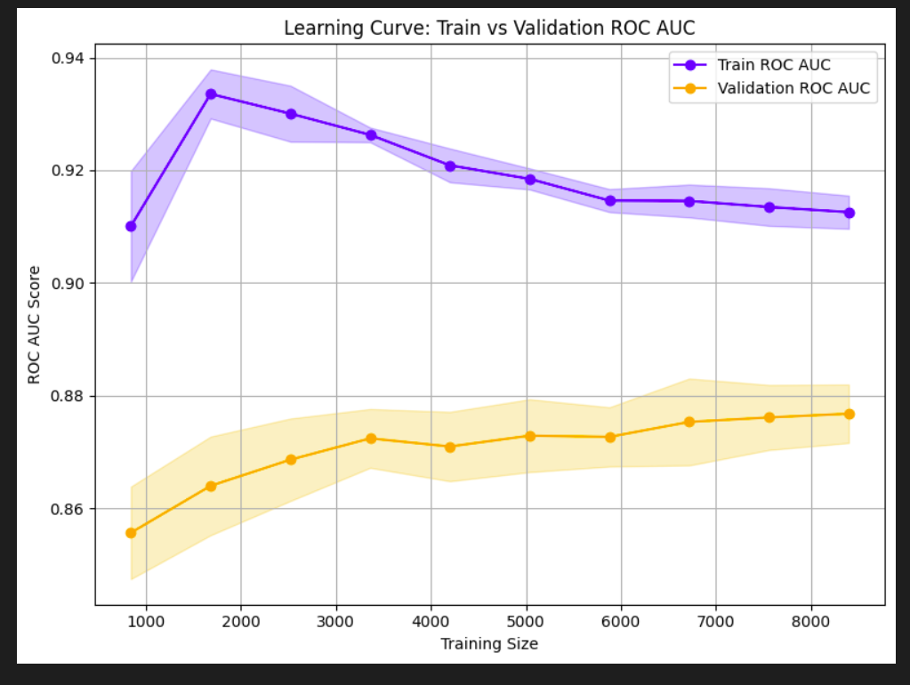

# Smoking Classification Model

This project classifies individuals based on whether they smoke using various machine learning algorithms. The dataset contains personal information used to predict smoking status through a classification approach.

## Table of Contents
1. [Overview](#overview)
2. [Dependencies](#dependencies)
3. [Data Preprocessing](#data-preprocessing)
4. [Modeling](#modeling)
5. [Optimization](#optimization)
6. [Overfitting Analysis](#overfitting-analysis)
7. [Results](#results)
8. [Conclusion](#conclusion)

## Overview
The goal of this project is to classify individuals as smokers or non-smokers using logistic regression, decision tree, and random forest models. RandomizedSearchCV and Optuna have been used to optimize these models' hyperparameters.

## Dependencies
Install required libraries:
```python
!pip install numpy pandas scikit-learn matplotlib optuna
```

## Data Preprocessing
1. **Loading Data**: Load the dataset containing individuals' personal details and smoking status.
2. **Cleaning**: Perform data cleaning steps (handle missing values, encoding categorical variables).
3. **Splitting**: Divide the data into training and testing sets.

```python
import pandas as pd
from sklearn.model_selection import train_test_split

data = pd.read_csv('path/to/dataset.csv')
X = data.drop('smoking_status', axis=1)
y = data['smoking_status']
X_train, X_test, y_train, y_test = train_test_split(X, y, test_size=0.2, random_state=42)
```

## Modeling
This project utilizes three primary models:
1. **Logistic Regression**
2. **Decision Tree Classifier**
3. **Random Forest Classifier**

Each model is evaluated for classification accuracy.

```python
from sklearn.linear_model import LogisticRegression
from sklearn.tree import DecisionTreeClassifier
from sklearn.ensemble import RandomForestClassifier
from sklearn.metrics import accuracy_score

# Example initialization and training of a model
model = LogisticRegression()
model.fit(X_train, y_train)
predictions = model.predict(X_test)
accuracy = accuracy_score(y_test, predictions)
```

## Optimization
`RandomizedSearchCV` and `Optuna` were used for hyperparameter tuning to improve model performance.

### RandomizedSearchCV Example:
```python
from sklearn.model_selection import RandomizedSearchCV

param_dist = {
    'n_estimators': [50, 100, 200],
    'max_depth': [None, 10, 20, 30],
    'min_samples_split': [2, 5, 10]
}
random_search = RandomizedSearchCV(RandomForestClassifier(), param_distributions=param_dist, n_iter=10)
random_search.fit(X_train, y_train)
```

### Optuna Optimization:
```python
import optuna

def objective(trial):
    n_estimators = trial.suggest_int('n_estimators', 50, 200)
    max_depth = trial.suggest_int('max_depth', 5, 30)
    model = RandomForestClassifier(n_estimators=n_estimators, max_depth=max_depth)
    model.fit(X_train, y_train)
    return accuracy_score(y_test, model.predict(X_test))

study = optuna.create_study(direction='maximize')
study.optimize(objective, n_trials=10)
```

## Overfitting Analysis
A learning curve is used to monitor overfitting, analyzing training and testing performance as the dataset size increases.

```python
from sklearn.model_selection import learning_curve
import matplotlib.pyplot as plt

train_sizes, train_scores, test_scores = learning_curve(RandomForestClassifier(), X, y, cv=5)

plt.plot(train_sizes, train_scores.mean(axis=1), label='Training score')
plt.plot(train_sizes, test_scores.mean(axis=1), label='Testing score')
plt.xlabel('Training Size')
plt.ylabel('Score')
plt.legend()
plt.show()
```


## Results
The models' accuracy scores were recorded, with the optimized Random Forest model achieving the best performance. The learning curve revealed overfitting tendencies that were adjusted by tuning hyperparameters.

## Conclusion
This classification model effectively distinguishes smokers and non-smokers using optimized machine learning techniques, achieving substantial accuracy with minimal overfitting.
